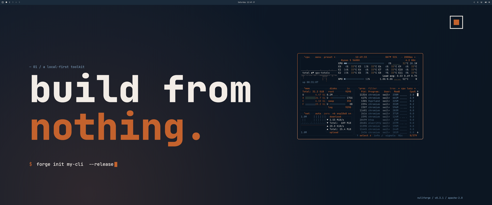

# Nullforge — Omarchy Theme

A complete [Omarchy](https://omarchy.org) theme: terminal, window manager, lock screen, notifications, status bar, app launcher, neovim, browser. Six brand-themed wallpapers included (3 designs × 16:9 + 21:9).

## Theme variant — dark (default)

This is a **dark** theme. There is no `light.mode` file in the folder, so Omarchy will treat surfaces accordingly: dark window chrome, light text. If you want a light variant (parchment surfaces, pitch text) we can add it — ask.

## Wallpapers

Three designs, each rendered at 16:9 (2560×1440) and 21:9 (3440×1440):

| File | Vibe |
|---|---|
| `01-void`  | Minimal logo mark — outlined void frame + filled Forge block + rising sparks. Best when you want the desktop to disappear. |
| `02-type`  | Typographic. `build from nothing.` display + `$ forge init` prompt. For when you want the brand to talk. |
| `03-ember` | Concentric Forge squares emerging from the center with an ember glow. The "forged from void" metaphor literalized. |

Want different sizes (4K 16:9, 5K 21:9, 3:2 for a Framework, anything portrait for verticals)? They regenerate from canvas — say the word.

Wallpapers live at `themes/omarchy/nullforge/backgrounds/` (theme-local) **and** `assets/wallpapers/` (project-wide, if you want to use them elsewhere — desktop, presentation backdrops, GitHub social cards).

## What each file controls

| File | Renders |
|---|---|
| `alacritty.toml` | Terminal: full 16-color ANSI palette mapped to brand. Selection, cursor, search, vi-mode. |
| `btop.theme`    | btop process viewer: gradient ramps for CPU/temp/memory, box colors, accent on title. |
| `chromium.theme`| Chromium/Electron frame, toolbar, tab text, NTP. |
| `hyprland.conf` | Window borders (Forge gradient when active), gaps 4/8, sharp corners (radius 2), hard-offset shadow, snappy animations on a single Forge bezier. |
| `hyprlock.conf` | Lock screen: 128px clock, dated comment, brand tag, password input with `$ enter password_` prompt placeholder, panic-style fail message. |
| `mako.ini`      | Notifications: Forge border, JetBrains Mono, urgency-keyed border colors, no-timeout for critical. |
| `neovim.lua`    | Full inline highlight stub — works **without** an external colorscheme plugin. Tries `colorscheme nullforge` first, falls back to inline `vim.api.nvim_set_hl()` calls covering core syntax, treesitter, diagnostics, telescope, git-signs. |
| `swayosd.css`   | Volume/brightness OSD with Forge progress bar. |
| `walker.css`    | App launcher: void surface, slate placeholders, Forge `$ ` prompt, Forge selection. |
| `waybar.css`    | Status bar: void background, Forge active workspace + underline, color-coded modules (CPU ember, memory slate, battery green, etc), Forge tooltip border. |

## Caveats

- **Omarchy file names** are based on the current convention (Hyprland-era). If your install uses different filenames (e.g. an older or forked Omarchy), rename and let me know — the colors are the same.
- **Waybar module names** in `waybar.css` assume the Omarchy defaults (`#workspaces`, `#custom-launcher`, etc.). If you've added custom modules, they'll inherit the default text color (`#f2ece6`) and need a one-line addition to tint them.
- **Neovim** — `neovim.lua` is self-contained and works on a fresh box. If you'd rather use a community Nullforge colorscheme plugin once it exists, the first line (`pcall(vim.cmd, "colorscheme nullforge")`) will pick it up automatically.
- The chromium theme JSON requires a tiny manifest wrapper for distribution as a `.crx` — for personal use Omarchy reads the JSON directly.

## Companion

Pair the Omarchy theme with the **VS Code themes** in `themes/nullforge-{dark,light}.json` and the **JetBrainsMono Nerd Font** install for a consistent look across editor + desktop. See `themes/README.md`.
